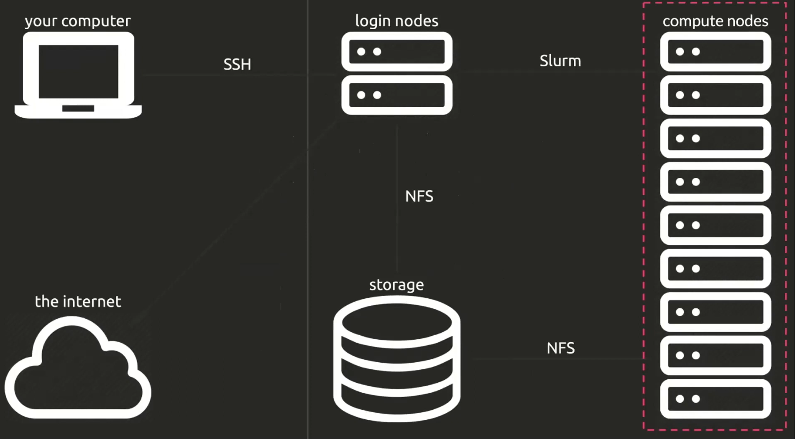

# Simple Linux Utility Resource Manager (SLURM)


- Introduction to slurm
- Connecting to the cluster
- sinfo command: (Nodes,and Partition  information)
- Interaction with slurm
    - batch jobs (job scripts)
    - interactive jobs
- Other slurm commands (managing jobs)
- Examples
- Slurm job arrays


## Slurm 
Slurm is a job scheduler and resource manager. It is used to manage resources on a cluster and to schedule jobs on the cluster.

<div></div>

Slurm manages:<br/>
- Time
- CPU cores
- Memory
- GPUs
- Nodes
- Jobs

A user asks slurm for certain resources and provides a work to do. Slurm will schedule and allocate those resources and report the job status back to the user.

## Connecting to the cluster
<p>
You can either connect to the cluster using<span style="color:red"> ssh</span> in a terminal but this limits what you can do in terms of writting code.

```bash
ssh username@ozerlabs
```
</p>

## sinfo command 

```bash 
#Get information about partitions and its nodes and resources 
# PARTITION   AVAIL  TIMELIMIT  NODES  STATE NODELIST
sinfo 

## all nodes & partitions
sinfo --all

## all nodes & partitions with more details
sinfo --all --long

#specific partition
sinfo --partition=main

#specific node
sinfo --node=nova101

#useful info
sinfo -Nel

sinfo -a "%P %D %N %G"

sinfo -h -N $partition $hostlist $statelist -O "NodeList,Partition,CPUs,Memory,Gres,GresUsed,Cluster,User"


#get more help
sinfo --help

man sinfo #useful

```


## Interaction with slurm
Slurm can be interacted with in two ways:
- sbatch command
- interactive jobs  

### sbatch command
The sbatch command is used to submit a job to slurm. The job is submitted as a job script.

```bash
sbatch [options] myJobScript.sh
```

In the job script we describe the resources that we need using directives. refer to [Script generator](https://rc.byu.edu/documentation/slurm/script-generator)  for a quick start.


```bash
#!/bin/bash

#SBATCH --job-name=jobName
#SBATCH --account=users
#SBATCH --partition=main
#SBATCH --nodes=1
#SBATCH --partition=main
#SBATCH --ntasks-per-node=1
##SBATCH --ntasks=4
#SBATCH --cpus-per-task=1
#SBATCH --mem=1G
#SBATCH --time=00:01:00
#SBATCH --partition=short
#SBATCH --output=jobName.out
#SBATCH --error=jobName.err

# load modules
module load python/3.7.3
# environment variables
export OMP_NUM_THREADS=$SLURM_CPUS_PER_TASK

# run program
srun python3 myProgram.py

#program with arguments
srun python3 myProgram.py arg1 arg2 arg3
```


### salloc
allocates resources in an interactive session (a shell).

```bash 
#salloc
salloc -n 1 -t 3:00:00 --mem-per-cpu 3G --pty bash

#sinteractive
sinteractive -N 1 -n 1 --nodelist=nodename --gres=gpu:1 -J int_jobs_name
```

## Other slurm commands (managing jobs)

```bash 
#show all jobs
squeue 

#user specific
squeue -u username

#jobs in a specific partition
squeue -p main

#jobs in a specific state
squeue -t running

## cancelling jobs
scancel jobID

#cancel all jobs
scancel -u username

#cancel job is a specific state

scancel -u ndigande -t running

## get help 
man scancel
man squeue 

## sacct 
#show account information
sacct 

#user specific
sacct -u username

#in specific time range
sacct -u username -S 2020-01-01 -E 2020-01-31


## admin info

## scontrol
scontrol show nodes|partition|job

#sacctmgr
sacctmgr list user

#sreport
sreport cluster AccountUtilizationByUser start=2020-01-01 end=2020-01-31

```


## Examples

```bash
#!/bin/bash

#SBATCH --job-name=singlecpu
#SBATCH --ntasks=1
#SBATCH --cpus-per-task=1

# Your script goes here
sleep 30
echo "hello"
```

```bash
#!/bin/bash

#SBATCH --job-name=singlecputasks
#SBATCH --ntasks=2
#SBATCH --cpus-per-task=1

# Your script goes here
srun --ntasks=1 echo "I'm task 1"
srun --ntasks=1 echo "I'm task 2"
```

```bash
#!/bin/bash

#SBATCH --job-name=multithreaded
#SBATCH --nodes=1
#SBATCH --ntasks=1
#SBATCH --cpus-per-task=8

# Your script goes here
mycommand --threads 8
```

```bash
#!/bin/bash

#SBATCH --job-name=multithreadedtasks
#SBATCH --nodes=4
#SBATCH --ntasks=4
#SBATCH --cpus-per-task=4

# Your script goes here
srun --ntasks=1 mycommand1 --threads 4
srun --ntasks=1 mycommand2 --threads 4
srun --ntasks=1 mycommand3 --threads 4
srun --ntasks=1 mycommand4 --threads 4
```


```bash
#!/bin/bash

#SBATCH --job-name=simplempi
#SBATCH --ntasks=16

# Your script goes here
mpirun myscript
```


```bash
#!/bin/bash

#SBATCH --job-name=nodempi
#SBATCH --ntasks=16
#SBATCH --ntasks-per-node=8

# Your script goes here
mpirun myscript
```


## Most Used Commands
### SINFO

```

sinfo

sinfo -Nel

sinfo -a "%P %D %N %G"

sinfo -h -N $partition $hostlist $statelist -O "NodeList,Partition,CPUs,Memory,Gres,GresUsed"


```

### squeue

```
squeue
```

### saccount

```
sacct
```


### jobs

```
scancel #####
```

## references
- [Slurm documentation](https://slurm.schedmd.com/documentation.html)
- [Slurm quick start guide](https://slurm.schedmd.com/quickstart.html)
- [Slurm tutorial](https://slurm.schedmd.com/tutorials.html)
- [Slurm job arrays](https://slurm.schedmd.com/job_array.html)
- [Ronin](https://blog.ronin.cloud/slurm-intro)
